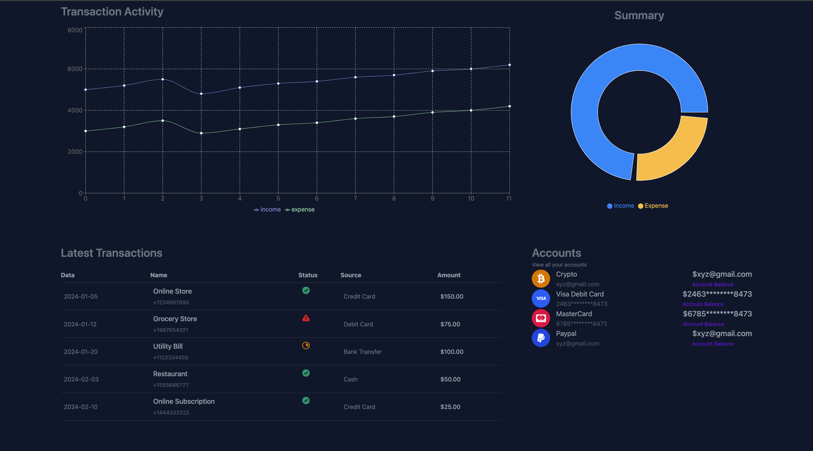
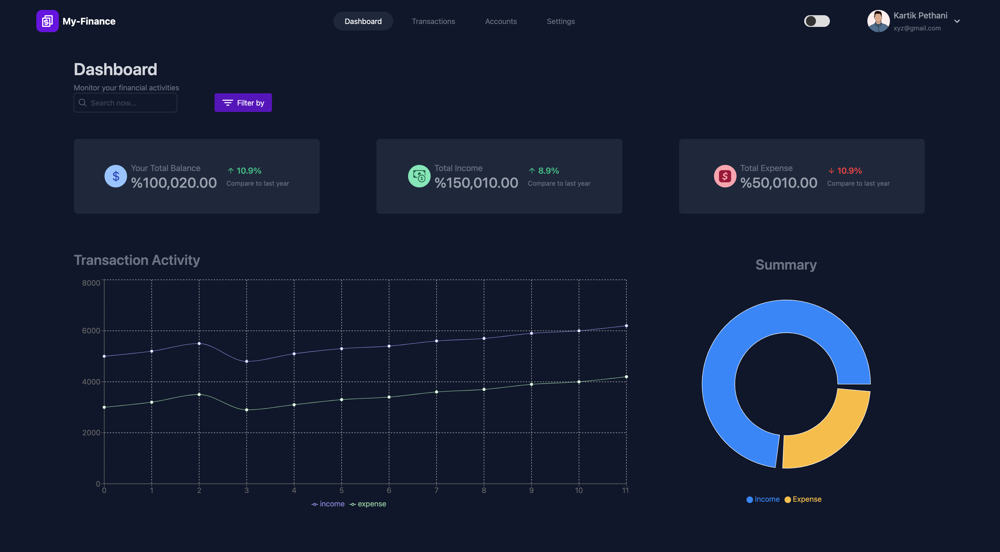

# Finance Dashboard

[WealthWise Demo](./demo.mov)



## Overview
Welcome to my Finance Dashboard project! This tool allows users to track their income and expenses effortlessly, helping them stay on top of their financial health. The dashboard features an intuitive and sleek interface, interactive charts, and easy navigation for a seamless experience.

## Tech Stack
- **React.js**: Used for building reusable components to create an efficient and dynamic user interface.
- **Zustand**: A simple state management solution for handling and maintaining the state across the application.
- **TailwindCSS**: A utility-first CSS framework that makes it simple to implement dark mode and create a responsive, clean design.
- **Recharts**: A powerful library for interactive data visualization, providing various chart types to visualize financial data effectively.

## Features
- **Track Income & Expenses**: Effortlessly manage and update your financial records.
- **Interactive Data Visualization**: Visualize your financial data with interactive charts and graphs using Recharts.
- **Dark Mode**: Easily toggle between light and dark mode with the help of TailwindCSS.
- **State Management**: Smooth user experience with real-time updates using Zustand.

## Installation
To get started with the Finance Dashboard locally, follow these steps:

1. Clone the repository:
   ```git clone https://github.com/kartik345/finance-dashboard.git```
2. Navigate to the project directory
   ```cd wealthWise```
3. Install all the dependencies
   ```npm install```
4. Start the development server
   ```npm run dev```
5. Open the browser and go to the local server link
   

